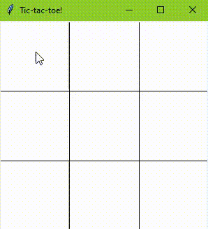
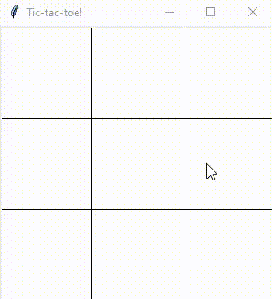

## Unbeatable Tic-Tac-Toe

 - Last Updated: 30 May 2020
 - Language: Python
 
#### Program Description:  

In order to help myself become familar to Python, I made this project when I found an interesting algorithm online. This program plays a game between the user and an AI. The AI functions by the mini-max algorithm. 

Due to the nature of tic-tac-toe, the AI will always be able to either win or tie the game. If you play optimally you will always tie.

And if you play less optimally, the AI usually finds a two-pronged attack

#### Techniques/Methods Used:
 * Object oriented programming
 * Mini-max algorithm
 * Events
 * Basic drawing
